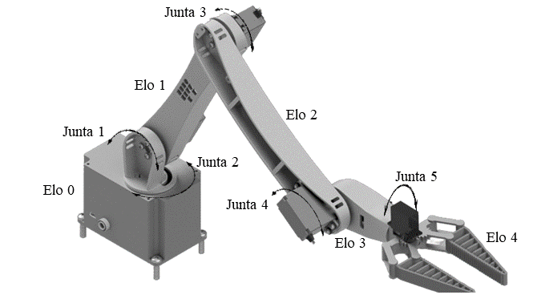
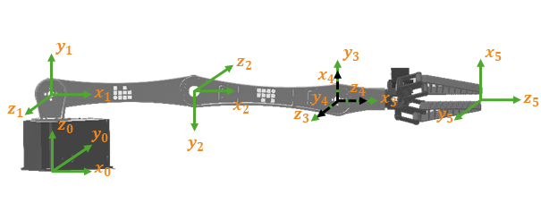
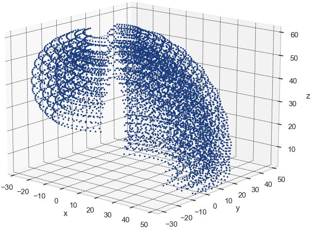

# Cinemática de um robô didático

O cálculo da cinemática inversa é um desafio na robótica, especialmente para manipuladores robóticos, e métodos tradicionais muitas vezes não são eficazes.
Este trabalho foca na solução da cinemática inversa de um robô manipulador didático com 5 graus de liberdade (DoF), disponível no laboratório da UFC, utilizando algoritmos de aprendizado de máquina com foco em abordagens de modelos locais e globais.

Especificamente, foram empregadas redes neurais Perceptron Multicamadas e o algoritmo K-means para os modelos locais segmentarem o espaço operacional. Inicialmente, a modelagem da cinemática direta é  realizada, utilizando a notação de Denavit-Hartenberg, de modo a gerar um banco de dados contendo informações do espaço cartesiano e do espaço das juntas do manipulador. Este banco de dados é então filtrado, removendo amostras inalcançáveis e amostras próximas entre si no  espaço cartesiano. A fase de otimização de hiperparâmetros para os modelos globais envolveu ajustar a melhor arquitetura das redes neurais, e para os modelos locais abrangeu determinar o número ````k```` de clusters que melhor dividisse o espaço operacional. A avaliação de desempenho dos algoritmos é feita com base nas medidas ````R²```` e ````MSE````, tanto no espaço das juntas como no espaço cartesiano, e os resultados obtidos evidenciam que ambas as abordagens se mostraram viáveis para a tarefa em questão, com a abordagem local superando a global.

## Requisitos

````
pip install -r requirements.txt
````

## Objetivo

O objetivo geral do trabalho consiste na aproximação da cinemática inversa de um robô manipulador didático através de algoritmos de aprendizado de máquina. Por isso, os seguintes objetivos específicos foram traçados:

- Estudar métodos para geração da cinemática direta de um manipulador robótico;
- Investigar dados relevantes que relacionem os ângulos das juntas com a posição cartesianas para fins de treinamento dos modelos de aprendizado de máquina;
- Pesquisar modelos de regressão para aproximação de cinemática inversa; 
- Investigar métodos de avaliação para os modelos que solucionam a cinemática inversa.

## Máterias e métodos

O braço robótico trata-se de um robô do tipo manipulador, desenvolvido em um módulo didático pelo grupo de pesquisa em robótica do [IFCE](https://robotica.ifce.edu.br/). Sua fabricação foi realizada por meio de uma impressora 3D, utilizando filamento de PLA, um material de baixo custo amplamente empregado em impressões tridimensionais.

<div align="center">
  
  <br>
  <em>Figura 1: Braço robótico didático</em>
</div>

### Modelagem Direta do Manipulador

A estrutura mecânica do braço é composta por cinco partes físicas interligadas por cinco juntas rotacionais (5 GDL), definindo o robô como um modelo 5𝑅.

<div align="center">
  
  <br>
  <em>Figura 2: Estrutura do braço robótico didático</em>
</div>

Devido ao mecanismo robótico ser constituido por 5 graus de liberdade de juntas rotativas, a cadeia cinemática possui cinco variáveis de juntas $\theta_{i}$, para $i = 1,...,5$. Utilizando as regras e etapas do método de Denavit-Hartenberg são fixados os sistemas de referência locais em cada elemento do robô e levantado os seus parâmetro D-H.

<div align="center">
  
  <br>
  <em>Figura 3: Sistema de coordenadas locais do manipulador didático</em>
</div>

A descrição da cinemática direta desse sistema está apresentada na Tabela abaixo, no qual define os parâmetros de Denavit-Hartenberg de cada elemento do manipulador.

| i | $\theta$ ($^\circ$) | $a$ ($cm$) | $d$ ($cm$) | $\alpha$ ($^\circ$) |
|---|----------------------|------------|------------|---------------------|
| 1 | $\theta_{1}$         | $0$         | $Elo_{0}$      | $+90$           |
| 2 | $\theta_{2}$         | $Elo_{1}$      | $0$           | $+180$        |
| 3 | $\theta_{3}$         | $Elo_{2}$      | $0$           | $-180$        |
| 4 | $\theta_{4} + 90$    | $0$           | $0$           | $+90$          |
| 5 | $\theta_{5}$         | $0$           | $Elo_{3}+ Elo_{4}$ | $0$       |

A validação da cinemática direta foi conduzida inserindo a parametrização D-H no modelo do braço robótico desenvolvido na biblioteca Robotics Toolbox for Python.

<div align="center">
  
  <br>
  <em>Figura 4: Simulação da modelagem direta do manipulador didático</em>
</div>

### Padrões de Treinamento

O método para geração dos padrões de treinamento passa pela modelagem da cinemática direta do manipulador. A base de dados representa todo o volume de trabalho e o comportamento dos ângulos das juntas do robô realizando o mapeamento das relações entre o espaço operacional e o espaço das juntas.

<div align="center">
  
  <br>
  <em>Figura 5: Volume de trabalho do manipulador didático</em>
</div>

A base de dados bruta possui $33275$ observações. A decisão de fixar $\theta_{5}=0$, por influenciar na orientação do efetuador, simplificou a geração dos padrões. A distribuição no número de amostras por junta 𝑁 permitiu uma cobertura eficaz dos eixos. O ângulo $\theta_{1}$ otimizou a exploração do espaço $(𝑥,𝑦)$ e os outros ângulos balancearam o eixo $𝑧$. Considerando $𝑁 = 25$ obteve-se um total de $456976$ amostras. Com as resoluções houve uma redução de $91,5\%$;

A ausência de tratamento nos dados pode gerando a construção de modelos pouco fiéis, aumento dos custos computacionais e dificuldade do modelo em entender os padrões de treinamento (Faceli, 2011). E por conta dos aspectos não lineares, as singularidades e as soluções mal postas das equações, levantarem a existências de múltiplas soluções, nenhuma solução ou soluções não admissíveis nas posições do efetuador (MELO, 2015), é definido um conjunto de pré-processamento dos dados.

Para um raio de similaridade de $𝑟_{𝑠}=1 𝑐𝑚$, a base de dados final passou a conter $6890$ amostras, representando uma redução de 20,7% dos dados originais. Contêm atributos de entradas que descrevem a posição $(𝑥,𝑦,𝑧)$ e as orientações Roll, Pitch e Yaw (𝜑,𝛽,𝜓) do efetuador no espaço tridimensional.

<div align="center">
  
  <br>
  <em>Figura 6: Volume de trabalho do manipulador sem redundâncias</em>
</div>