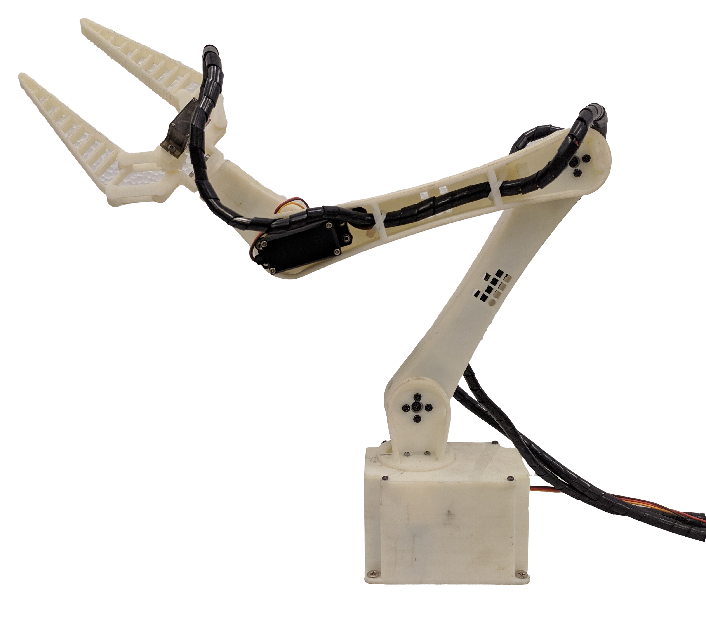

# Introdução

O aprendizado de máquina continua evoluindo e possui diversas aplicações práticas como é o caso do uso em sistemas de reconhecimento de voz, na detecção de atividades fraudulentas em transações bancárias e na análise de imagens médicas auxiliando o diagnóstico médico de doenças.
 
Um exemplo de algoritmo máquina utilizado para a modelagem da cinemática de manipuladores são as RNAs, as quais, segundo algumas literaturas, têm tido uma abordagem promissora nesta aplicação. A partir destas, não há mais dependência de soluções analíticas mais complexas, visto que RNAs são conhecidas por  serem aproximadoras universais de funções.

Diante deste problema, este trabalho se debruça na solução da cinemática inversa do robo manipulado didático com 5 DoF (graus de liberdades) disponível no lab da ufc, utilizando algoritmos de aprendizado de máquina.

## Objetivo
O objetivo geral do trabalho consiste na aproximação da cinemática inversa de um robô manipulador didático através de algoritmos de aprendizado de máquina. Por isso, os seguintes objetivos específicos foram traçados: 
- Estudar e gerar a cinemática direta do manipulador robótico. 
- Investigar formas de gerar dados relevantes que relacionem os ângulos das       juntas com a posição no plano tridimensional. 
- Pesquisar os modelos de regressão utilizados para aproximação de                cinemática inversa.	 
- Investigar os métodos de validação dos modelos projetados.

# Máterias e métodos

O braço robótico é apresentado na figura abaixo. Trata-se de um robô do tipo manipulador, desenvolvido em um módulo didático pelo grupo de pesquisa em robótica do [IFCE](https://robotica.ifce.edu.br/). Sua fabricação foi realizada por meio de uma impressora 3D, utilizando filamento de PLA, um material de baixo custo amplamente empregado em impressões tridimensionais.

